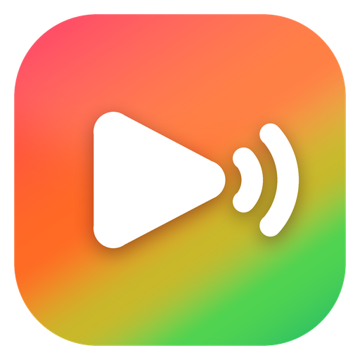
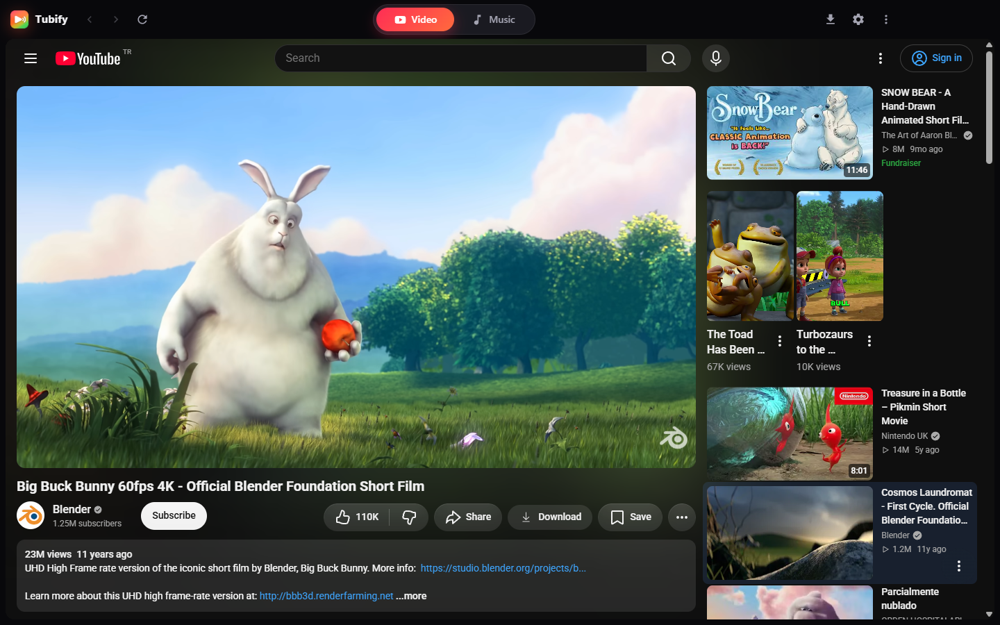
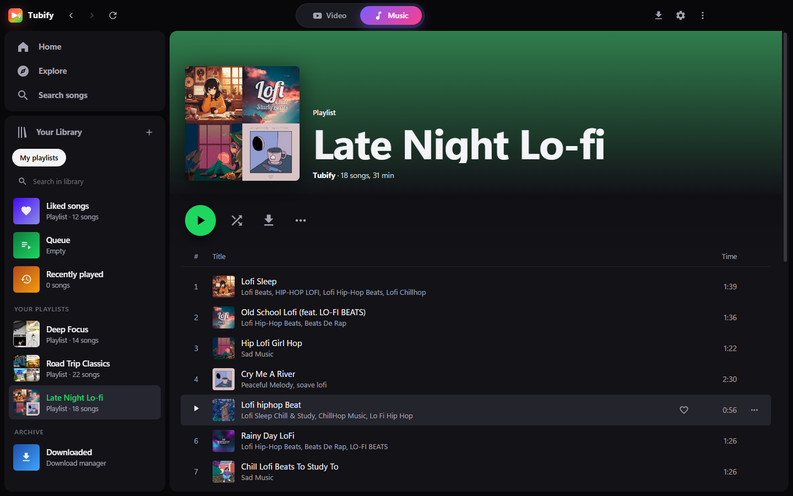
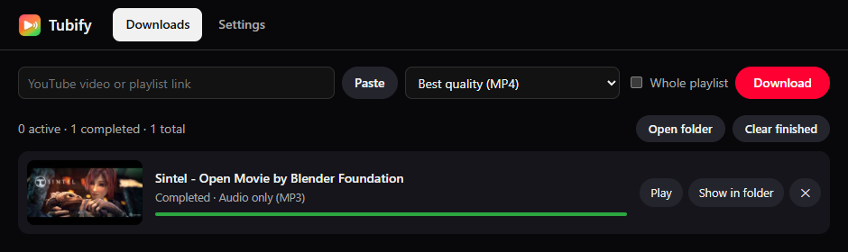

<div align="center">



# Tubify

**YouTube ve YouTube Music için resmi olmayan bir masaüstü istemcisi.**

Tubify, resmi youtube.com ve music.youtube.com sitelerini hafif bir Windows uygulamasında açar.<br>
İsteğe bağlı reklam ve izleyici engelleyici, SponsorBlock, yerel müzik kitaplığı ve medya kaydedici ekler. Hesap gerekmez.

[](https://github.com/1ZoZ1/tubify/releases/latest)
[](https://github.com/1ZoZ1/tubify/releases)
[](#i̇ndir)
[](LICENSE)

[English](README.md) · **Türkçe**



<sub>Tubify bağımsız, açık kaynaklı bir projedir. Google LLC ya da YouTube tarafından yapılmamış, onaylanmamış ve desteklenmemektedir. Bkz. <a href="#yasal-uyarı">yasal uyarı</a>.</sub>

</div>

---

## Tubify nedir?

Tubify iki sekmeli bir masaüstü uygulamasıdır:

- **Video** sekmesi **youtube.com**'u açar
- **Müzik** sekmesi **music.youtube.com**'u açar

İki sekme de resmi siteleri olduğu gibi, doğrudan YouTube'dan yükler. Tubify hiçbir videoyu ya da müziği barındırmaz, kopyalamaz, yeniden yayınlamaz veya değiştirmez. Sitelerin üzerine, insanların tarayıcılarında zaten kullandığı türden kullanıcı tarafı araçlar ekler: reklam ve izleyici engelleyici, SponsorBlock, klavye kısayolları ve yerel bir kitaplık.

- **Hızlı ve sade.** Tarayıcı sekmeleriyle ya da eklentilerle uğraşmazsın. Oynatma hızlı başlar, pencereyi kapatsan da bildirim alanında sürer.
- **Gerçek siteler.** Abonelikler, yorumlar, öneriler ve 4K/HDR oynatma sitedekiyle birebir aynı çalışır.
- **Kayıt yok.** Müzik kitaplığın, listelerin ve beğendiğin şarkılar bilgisayarında durur. YouTube'a giriş yapmak isteğe bağlıdır ve Google'ın kendi giriş sayfasında yapılır.

## Özellikler

| | |
|---|---|
| 🛡️ **Reklam ve izleyici engelleme** | İsteğe bağlıdır, varsayılan olarak açıktır. Tıpkı bir tarayıcı eklentisi gibi herkese açık uBlock Origin, EasyList ve EasyPrivacy filtre listelerini kullanır. İstediğin zaman Ayarlar'dan kapatabilirsin. |
| ⏭️ **SponsorBlock** | Topluluğun işaretlediği bölümleri (sponsor tanıtımları, girişler, çıkışlar, hatırlatmalar) otomatik atlar. Geri alma düğmesi vardır, her kategoriyi ayrı ayrı açıp kapatabilirsin. |
| 🎵 **Müzik modu** | Yan panelde kitaplığı olan music.youtube.com: yerel listeler, beğenilen şarkılar, çalma sırası, karıştırma, tekrarlama ve otomatik oynatma. |
| 💾 **Medya kaydedici** | **Kaydetme hakkın olan** videoları ya da sesleri kaydeder; örneğin kendi yüklediklerini, Creative Commons lisanslı ya da kamu malı eserleri. yt-dlp ve FFmpeg üzerine kuruludur. Tubify DRM korumalı içerikle **çalışmaz**. |
| 🌙 **Bildirim alanında çalışır** | Pencereyi kapatınca müzik çalmaya devam eder. Oynatmayı tepsi simgesinden kontrol edebilir, menüsünden çıkabilirsin. |
| 🔒 **Gizlilik** | Telemetri ya da analiz yok. Siteler bildirim, konum, kamera ve mikrofon izni alamaz. |
| 🌍 **Türkçe & English** | Dili ilk açılışta seç, istediğin zaman Ayarlar'dan değiştir. |
| ⌨️ **Klavye kısayolları** | `Ctrl+1/2` video ile müzik arasında geçer, `Ctrl+Shift+V` panodaki bağlantıyı açar, `F11` tam ekran yapar. Daha fazlası da var. |

<div align="center">


</div>

## İndir

[Son sürüm](https://github.com/1ZoZ1/tubify/releases/latest) sayfasında iki seçenek var:

| Dosya | Ne için |
|---|---|
| **`Tubify-Setup-x.y.z.exe`** | Kurulum dosyası (önerilen). Başlat Menüsü ve masaüstü kısayolu ekler, bildirimleri ve kaldırmayı destekler. |
| **`Tubify-Portable-x.y.z.exe`** | Kurulum gerektirmeyen tek bir exe. Herhangi bir klasörden ya da USB bellekten çalıştırabilirsin. Ayarlar yine `%APPDATA%\Tubify` içinde tutulur. |

Tubify ilk açılışta dili ve dosyaların kaydedileceği klasörü sorar.

> **Windows SmartScreen** uyarı verebilir, çünkü kurulum dosyası kod imzalı değil. **Ek bilgi → Yine de çalıştır**'a tıkla. İstersen kaynak kodu inceleyip kendin de derleyebilirsin (aşağıya bak).

**Gereksinimler:** Windows 10 ya da 11 (64 bit) ve yaklaşık 300 MB disk alanı. yt-dlp ve FFmpeg, medya kaydediciyi ilk kullandığında resmi kaynaklarından indirilir.

## Sık sorulanlar

<details>
<summary><b>Ücretsiz mi?</b></summary>

Evet. Tubify MIT lisanslı açık kaynak bir projedir. Reklam, ücretli sürüm ya da takip yoktur ve hiçbir şekilde para kazanmaz.
</details>

<details>
<summary><b>Google hesabı gerekiyor mu?</b></summary>

Hayır. Müzik kitaplığı, listeler, beğenilenler ve çalma sırası bilgisayarında saklanır. Aboneliklerini ve geçmişini görmek istersen Google'ın kendi giriş sayfasından YouTube'a giriş *yapabilirsin*. Tubify şifreni hiçbir zaman görmez ve saklamaz.
</details>

<details>
<summary><b>Reklam engelleyiciyi kapatabilir miyim?</b></summary>

Evet: **Ayarlar → Reklam engelleme**. Bir içerik üreticisini seviyorsan onu doğrudan ya da YouTube Premium üzerinden desteklemeyi düşünebilirsin.
</details>

<details>
<summary><b>Dosyalarım ve ayarlarım nerede?</b></summary>

Kaydedilen dosyalar ilk açılışta seçtiğin klasöre gider (varsayılan `İndirilenler\Tubify`). Ayarlar ve kitaplık `%APPDATA%\Tubify` klasöründedir; **⋮ → Yardım → Veri klasörünü aç** ile açabilirsin.
</details>

<details>
<summary><b>Bir şey çalışmayı bıraktı</b></summary>

Siteler sık sık değişiyor. **⋮ → Yardım → Reklam filtrelerini şimdi güncelle**'yi dene, sonra `Ctrl+F5` ile yenile. Hâlâ çalışmıyorsa [bir issue aç](https://github.com/1ZoZ1/tubify/issues).
</details>

## Kaynaktan derleme

```bash
git clone https://github.com/1ZoZ1/tubify.git
cd tubify
npm install
npm start          # geliştirme modunda çalıştır
npm run dist       # kurulum dosyasını ve portable exe'yi dist/ klasörüne derle
```

Node.js 20+ ve Windows gerekir.

## Kaputun altında

- **Kabuk:** Özel çerçevesiz üst çubuk ve kenar çubuğu altında iki `WebContentsView` (video ve müzik) çalıştıran Electron.
- **SponsorBlock:** Bölümler herkese açık [SponsorBlock API](https://sponsor.ajay.app)'sinden gelir.
- **Medya kaydedici:** [yt-dlp](https://github.com/yt-dlp/yt-dlp) + [FFmpeg](https://ffmpeg.org). İkisi de resmi sürümlerinden uygulamanın veri klasörüne indirilir.
- **Kitaplık:** Diskte düz JSON (`library.json`, `queue.json`).

### Reklam engelleme motoru

Tubify'ın reklam engellemesi, uBlock Origin ya da AdGuard gibi tarayıcı eklentileriyle aynı şekilde, yalnızca kullanıcının kendi cihazında ve kendi uygulama oturumunda çalışır. YouTube'un sunucularına ya da diğer kullanıcılara dokunmaz, DRM'li veya şifreli içerikle ilgilenmez.

#### Basit bir filtre artık neden yetmiyor?

YouTube'da reklamlar giderek daha çok videoyla **aynı medya akışının içinde** geliyor (sunucu tarafı reklam yerleştirme). Sayfa verisi geldikten sonra içinden yalnızca reklam kayıtlarını silen bir engelleyici, oynatıcıyı çoğu zaman siyah ekranda bekletir. Birkaç yöntemi ölçtük:

| Yöntem | Gözlemlediğimiz |
|---|---|
| Oynatıcı verisi geldikten sonra reklam kayıtlarını silmek | Siyah ekran, oynatma başlamadan 5–24 sn gecikme |
| Reklamı ileri sarmak | Aynı gecikme |
| Sayfa zamanlayıcılarını hızlandırmak | Etkisiz |
| **Oynatıcı verisini reklam yerleşimi içermeyen biçimde istemek** | **Yaklaşık 0,8 sn'de oynatma** |

#### Nasıl çalışıyor?

Tubify, uBlock Origin gibi, yanıtı sonradan düzenlemek yerine sayfanın gönderdiği **isteği** ayarlar. Dört katmandan oluşur:

**Katman 0: ağ filtreleri** ([`src/main/adblock.js`](src/main/adblock.js))
Herkese açık uBlock Origin, EasyList ve EasyPrivacy listeleriyle yüklenen açık kaynaklı Ghostery motoru, bilinen reklam ve izleme sunucularına giden istekleri engeller, reklam öğelerini CSS ile gizler. Listeler günde bir güncellenir.

**Katman 1: oynatıcı isteği** ([`src/preload/youtube.js`](src/preload/youtube.js))
1. Oynatıcı isteğinin okunabilir JSON olarak gitmesi için sayfa yapılandırmasındaki birkaç deneysel özellik kapatılır.
2. Oynatıcı isteğine, reklam yerleşimi olmadan oynatma isteyen bir `params` değeri eklenir ve istek yeniden yükleme olarak işaretlenir.
3. Bir değer bir video için kabul edilmezse Tubify yalnızca o video için sıradakine geçer (`8AUB` → `YAHI` → orijinal istek). Değiştirilmemiş istek her zaman son seçenektir, böylece videolar oynatılabilir kalır.

**Katman 2: yanıt temizliği (güvenlik ağı)**
Oynatıcı verisinde kalan reklam yerleşimi kayıtları, oynatıcı okumadan önce silinir.

**Katman 3: oynatma koruması (son çare)**
Yine de reklam oynarsa sesi kısılır ve atlanır. Engelleyici algılama pencereleri kapatılır. Boşta kalma zaman damgası da yenilenir, böylece "İzlemeye devam edilsin mi?" uyarısı müziği kesmez.

#### Tarayıcı eklentisinden farkı

| | Tarayıcı + eklenti | Tubify |
|---|---|---|
| **Kodun çalıştığı an** | İçerik betiği olarak, bazen sayfanın kendi betiklerinden sonra yüklenir | Sayfanın ana dünyasında, **her sayfa betiğinden önce** çalışır (`contextBridge.executeInMainWorld`). Böylece her zaman önce kurulmuş olur. |
| **İlk sayfa yüklemesi** | İlk sayfa verisi hâlâ reklam kaydı içerebilir | Tubify bunu fark edip oynatıcıyı bir kez temiz istekle yeniden yükler. Doğrudan açılan bağlantılar da temiz başlar. |
| **Reddedilen istek** | Sonraki bir filtre listesi güncellemesiyle düzelir | `playabilityStatus`'tan algılanır ve **yalnızca o video için** yeniden denenir |
| **Genel betikler (scriptlet)** | Sayfa yüklenince enjekte edilir | Bilerek kapatıldı, çünkü çok geç yükleniyor ve sayfayı bozabiliyorlar |

> Siteler sık sık değişiyor. Genellikle yalnızca `src/preload/youtube.js` içindeki değerleri güncellemek yetiyor. Pull request'lere açığız.

## Katkı

Issue ve pull request'ler memnuniyetle karşılanır. DRM aşma, ücretli ya da yalnızca üyelere açık içeriği indirme veya telif hakkı yasalarını çiğneyecek başka herhangi bir şey için issue ya da PR **açma**. Bunlar kapatılır.

## Yasal uyarı

- **Resmi değildir.** Tubify bağımsız, ticari olmayan, açık kaynaklı bir projedir. **Google LLC ya da YouTube ile bağlantılı değildir; onlar tarafından onaylanmamış, desteklenmemiş ya da sponsor olunmamıştır.** "YouTube", "YouTube Music" ve ilgili adlar ve logolar Google LLC'nin ticari markalarıdır. Burada yalnızca uygulamanın hangi siteleri açtığını belirtmek için kullanılmıştır. Tubify kendi markasında YouTube logolarını kullanmaz.
- **İçerik barındırılmaz ya da dağıtılmaz.** Tubify hiçbir videoyu, sesi ya da başka içeriği barındırmaz, önbelleğe alıp dağıtmaz, yeniden yayınlamaz. İzlediğin ve dinlediğin her şey YouTube tarafından, kendi oturumunda, doğrudan senin cihazına sunulur.
- **Yalnızca kullanıcı tarafı araçlar.** Reklam engelleme, SponsorBlock ve diğer özellikler yalnızca senin bilgisayarında çalışır ve kapatılabilir. Yaygın kullanılan tarayıcı eklentileriyle aynı şekilde çalışırlar.
- **DRM aşılmaz.** Tubify DRM'yi ya da başka herhangi bir teknik kopya koruma önlemini çözmez, kaldırmaz veya aşmaz; böyle bir amacı da yoktur.
- **Sorumluluk sende.** Yalnızca sahibi olduğun, kaydetme iznin olan ya da buna uygun lisanslı içerikleri kaydet (örneğin kendi yüklemelerin, Creative Commons ya da kamu malı eserler). Ülkendeki telif hakkı yasalarına ve [YouTube Hizmet Şartları](https://www.youtube.com/t/terms)'na uymak senin sorumluluğundadır. Geliştiriciler telif hakkı ihlalini teşvik etmez ve onaylamaz.
- **Garanti yoktur.** Tubify, [MIT Lisansı](LICENSE) kapsamında, hiçbir garanti olmaksızın "olduğu gibi" sunulur. Geliştiriciler yazılımın nasıl kullanıldığından sorumlu tutulamaz.
- **Kaldırma talebi ve iletişim.** Hak sahibiysen ve bu depodaki bir şeyin haklarını ihlal ettiğini düşünüyorsan lütfen [bir issue aç](https://github.com/1ZoZ1/tubify/issues) ya da GitHub üzerinden geliştiriciyle iletişime geç. İnceleyip hızla yanıt veririz.

## Teşekkürler

- [SponsorBlock](https://sponsor.ajay.app): Ajay Ramachandran ve katkıda bulunanlar. Bölüm verisi [CC BY-NC-SA 4.0](https://creativecommons.org/licenses/by-nc-sa/4.0/) lisanslıdır.
- [uBlock Origin](https://github.com/gorhill/uBlock) filtre listeleri, [EasyList](https://easylist.to), [EasyPrivacy](https://easylist.to).
- [Ghostery adblocker](https://github.com/ghostery/adblocker) (MPL-2.0), [yt-dlp](https://github.com/yt-dlp/yt-dlp) (Unlicense), [FFmpeg](https://ffmpeg.org) (LGPL/GPL), [Electron](https://www.electronjs.org) (MIT).

Lisans ayrıntıları için [THIRD_PARTY_NOTICES.md](THIRD_PARTY_NOTICES.md) dosyasına bak.

<div align="center">
<sub>Türkiye'de ❤️ ile yapıldı · <a href="LICENSE">MIT Lisansı</a> · Google LLC ya da YouTube ile bağlantılı değildir</sub>
</div>
